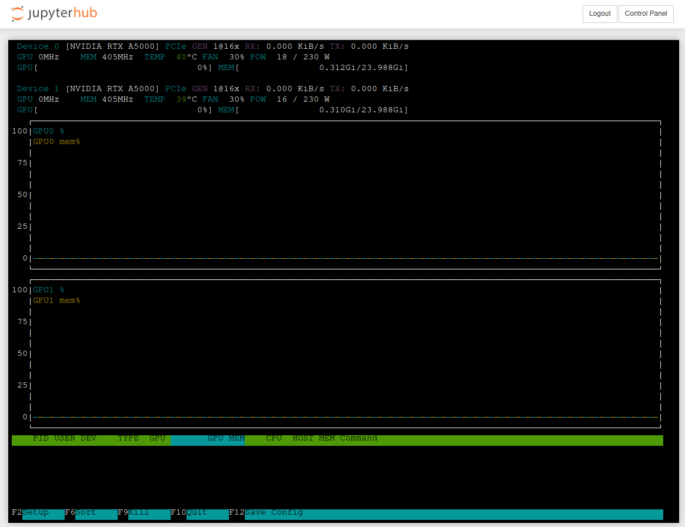

[<!--lint ignore no-dead-urls-->](https://github.com/a2s-institute/docker-stacks/actions?workflow=cuda11.3.1-ubuntu20.04)
[<!--lint ignore no-dead-urls-->](https://github.com/a2s-institute/docker-stacks/actions?workflow=cuda11.8.0-ubuntu22.04)
[](https://quay.io/repository/a2s-institute/docker-stacks/gpu-notebook)

# a2s-institute docker images

Our stacks provide GPU-enabled Jupyter Notebook in Docker containers, which can also be run on Kubernetes. The image is based on [released cuda version](https://hub.docker.com/r/nvidia/cuda/tags?page=1&name=12.) on docker hub and the Jupyter stacks are based on [jupyter/docker-stacks](https://github.com/jupyter/docker-stacks/). All images are published on our [github registry](https://github.com/orgs/a2s-institute/packages).

The stacks contain several machine learning packages such as TensorFlow, PyTorch, scikit-learn, and other machine learning tools.

## Building and running gpu-notebook in a local Docker container

The base image  contains several packages for deep learning projects with NVidia GPU support.

* Build notebook image with gpu support
  ```
  bash build_and_publish.sh --registry ghcr.io --publish "" --cuda-version cuda11.8.0-ubuntu22.04
  ```

  You can build this image using different cuda versions available [here](https://hub.docker.com/r/nvidia/cuda/tags).

* Run the image locally
  ```
  docker run --gpus all --name gpu-notebook -it --rm -d -p 8880:8888 ghcr.io/b-it-bots/docker/gpu-notebook:cuda11.8.0-ubuntu22.04
  ```

* Login to the container
  ```
  docker exec -ti gpu-notebook bash

  # check nvidia
  nvidia-smi
  ``` 

## Available images

* `cuda11.3.1-ubuntu20.04` (python=3.10, pytorch=1.12.1)
* `cuda11.8.9-ubuntu22.04` (python=3.11, pytorch=2.0.0)

## Monitoring

You can monitor the GPU usage using nvtop


